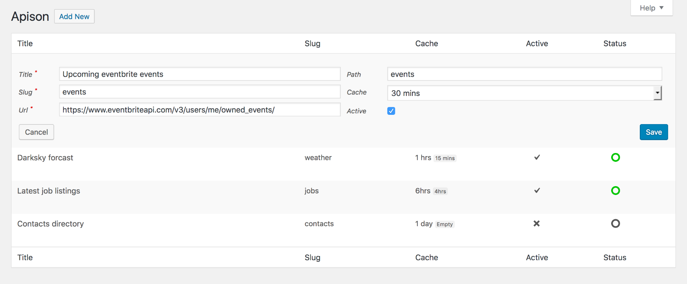

# Apison

Apison is little WordPress plugin to fetch, cache and access API data (JSON).

Simply add your api endpoints (with token if applicable) in the WordPress admin (under Settings->Apison), then you can access the cached API data via the helper class or rest endpoints.

## Admin interface


## Fetching cached API data via PHP

```php
<?php
use Lambry\Apison\Frontend\Api;

// Get all jobs
Api::get('jobs')->all();

// Get full forcast with just humidity and temperature fields
Api::get('forcast')->with(['humidity', 'temperature'])->all();

// Get all contacts with a role of either sales or marketing
Api::get('contacts')->where('role', ['sales', 'marketing'])->all();

// Get the last 10 listings that have a price greater than 100
Api::get('listings')->where('price', 'gt', 100)->last(10);

// Get the first 20 events offset by 20 that are not in the sports category
Api::get('events')->where('category', 'not', 'sports')->first(20, 20);

// Get the title and price for all products that are currently on sale and are priced under 50
Api::get('products')->where('sale', true)->and('price', 'lt', 50)->with(['title', 'price'])->all();
```

## Fetching cached API data via rest endpoints
```html
<!-- Get all jobs -->
/wp-json/apison/jobs

<!-- Get full forcast with just humidity and temperature fields -->
/wp-json/apison/forcast?with=humidity,temperature

<!-- Get all contacts with a role of either sales or marketing -->
/wp-json/apison/contacts?role=sales,marketing

<!-- Get the last 10 listings that have a price greater than 100 -->
/wp-json/apison/listings?price.gt=100&last=10

<!-- Get the first 20 events offset by 20 that are not in the sports category -->
/wp-json/apison/events?category.not=sports&first=20,20

<!-- Get the title and price for all products that are currently on sale and are priced under 50 -->
/wp-json/apison/products?sale=true&price.lt=50&with=title,price
```

### Filters
`apison/cache`: filters the avaible options in the admin cache select box, i.e. 15mins, 1hr etc.

`apison/permission`: sets which permission to use when registering the admin menu.

### Notes
The accepted where/and clause opterators are: `is`, `not`, `gt` (greater than), `lt` (less than), `gte` (greater than or equal to) and `lte` (less than or equal to).

Any cached anypoint can be forcibly refreshed by hitting refresh/endpoint i.e. `/wp-json/apison/refresh/jobs` or `/wp-json/apison/refresh/forcast`.

This plugin requires WordPress `4.8.0+` and PHP `7.1.0+`.
